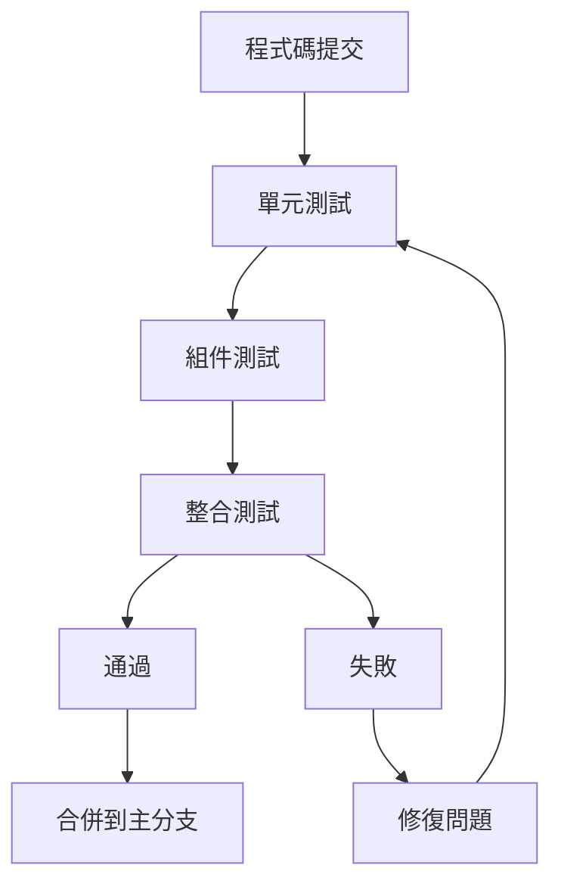
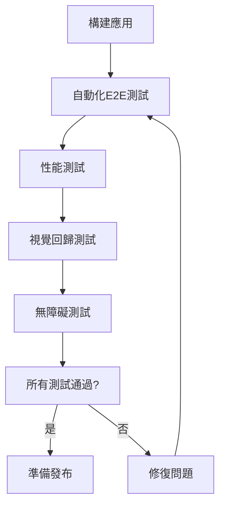

# 跨裝置兼容性測試方案

## 概述
本方案旨在確保遊戲在所有目標裝置上都能正常運行，提供一致的用戶體驗。測試將涵蓋功能、性能、視覺和互動等方面。

## 測試目標裝置

### 1. 手機裝置 (320px - 767px)
- **iPhone系列**: iPhone 15/14/13/12, iPhone SE
- **Android系列**: Samsung Galaxy S23/S22, Google Pixel 7/6, OnePlus 11
- **螢幕尺寸**: 5.4" - 6.8"
- **解析度**: 1080x2340 到 1440x3200
- **刷新率**: 60Hz - 120Hz

### 2. 平板裝置 (768px - 1023px)
- **iPad系列**: iPad Pro 12.9", iPad Air, iPad mini
- **Android平板**: Samsung Galaxy Tab S9, Google Pixel Tablet
- **螢幕尺寸**: 8.3" - 12.9"
- **解析度**: 1488x2266 到 2732x2048
- **方向**: 橫向和縱向

### 3. 桌面裝置 (1024px+)
- **筆記型電腦**: MacBook Pro/Air, Windows筆電 (13" - 16")
- **桌上型電腦**: 1080p, 1440p, 4K顯示器
- **超寬螢幕**: 21:9, 32:9 比例
- **解析度**: 1920x1080 到 5120x1440

## 測試類別

### 1. 功能測試 (Functional Testing)

#### 核心遊戲功能
```typescript
// 測試用例示例
describe('跨裝置遊戲功能測試', () => {
  test('卡片系統在所有裝置上正常工作', async () => {
    // 測試卡片抽牌、出牌、顯示
    // 驗證觸控和滑鼠互動
  });

  test('角色互動在所有裝置上正常', async () => {
    // 測試角色點擊、對話、移動
    // 驗證觸控目標大小
  });

  test('UI組件在所有裝置上正常顯示', async () => {
    // 測試側邊欄、底部區域、彈出窗口
    // 驗證佈局適應性
  });
});
```

#### 裝置特定功能
- **手機**: 觸控手勢、虛擬鍵盤、裝置方向
- **平板**: 分屏模式、手寫筆支援、多點觸控
- **桌面**: 鍵盤快捷鍵、滑鼠滾輪、右鍵選單

### 2. 視覺測試 (Visual Testing)

#### 佈局測試
```typescript
// 使用視覺回歸測試
describe('視覺佈局測試', () => {
  test('手機佈局正確', async () => {
    // 設定視窗大小為 375x812 (iPhone 13)
    await page.setViewport({ width: 375, height: 812 });

    // 截圖並與基準圖像比較
    const screenshot = await page.screenshot();
    expect(screenshot).toMatchImageSnapshot();
  });

  test('平板佈局正確', async () => {
    // 橫向和縱向測試
    await page.setViewport({ width: 1024, height: 768 });
    // ... 測試邏輯
  });

  test('桌面佈局正確', async () => {
    await page.setViewport({ width: 1920, height: 1080 });
    // ... 測試邏輯
  });
});
```

#### 響應式設計測試
- **斷點測試**: 確保在每個斷點正確切換佈局
- **流體縮放測試**: 驗證畫布和UI元素的縮放行為
- **文字可讀性測試**: 確保文字大小適合裝置

### 3. 性能測試 (Performance Testing)

#### 載入性能
```typescript
// 使用Web性能API
describe('載入性能測試', () => {
  test('首次內容繪製時間 < 1.5秒', async () => {
    const navigationTiming = await page.evaluate(() =>
      performance.getEntriesByType('navigation')[0]
    );
    expect(navigationTiming.domContentLoadedEventEnd).toBeLessThan(1500);
  });

  test('最大內容繪製時間 < 2.5秒', async () => {
    const paintTiming = await page.evaluate(() =>
      performance.getEntriesByType('paint')
    );
    const lcp = paintTiming.find(entry => entry.name === 'largest-contentful-paint');
    expect(lcp.startTime).toBeLessThan(2500);
  });
});
```

#### 運行時性能
- **幀率測試**: 確保60fps的流暢度
- **記憶體使用**: 監控記憶體洩漏
- **CPU使用率**: 確保不會過度消耗資源

#### 網路性能
- **資源載入**: 圖片、字體、腳本的載入時間
- **快取策略**: 驗證Service Worker和HTTP快取
- **離線功能**: 測試離線可用性

### 4. 互動測試 (Interaction Testing)

#### 觸控測試
```typescript
// 使用Playwright進行觸控模擬
describe('觸控互動測試', () => {
  test('卡片點擊觸控目標足夠大', async () => {
    const card = await page.$('.card-item');
    const boundingBox = await card.boundingBox();

    // 驗證觸控目標最小44x44px
    expect(boundingBox.width).toBeGreaterThanOrEqual(44);
    expect(boundingBox.height).toBeGreaterThanOrEqual(44);
  });

  test('手勢操作正常工作', async () => {
    // 測試滑動、捏合、長按等手勢
    await page.touchscreen.tap(100, 100);
    await page.touchscreen.swipe(100, 100, 200, 100);
  });
});
```

#### 輸入裝置測試
- **滑鼠互動**: 懸停、點擊、拖放
- **鍵盤導航**: Tab鍵導航、快捷鍵
- **遊戲手柄**: 如果支援的話

### 5. 無障礙測試 (Accessibility Testing)

#### WCAG合規性
```typescript
// 使用axe-core進行無障礙測試
describe('無障礙測試', () => {
  test('符合WCAG 2.1 AA標準', async () => {
    const results = await axe.run(page);
    expect(results.violations).toHaveLength(0);
  });

  test('文字對比度足夠', async () => {
    // 測試主要文字元素的對比度
    const contrastResults = await checkColorContrast(page);
    expect(contrastResults.pass).toBe(true);
  });
});
```

#### 輔助技術測試
- **螢幕閱讀器**: VoiceOver (iOS/macOS), TalkBack (Android), NVDA (Windows)
- **鍵盤導航**: 確保所有功能可透過鍵盤訪問
- **動畫控制**: 尊重使用者動畫偏好

## 測試工具和框架

### 1. 自動化測試工具
- **Playwright**: 跨瀏覽器自動化測試
- **Jest**: JavaScript測試框架
- **Testing Library**: React組件測試
- **Cypress**: E2E測試

### 2. 性能測試工具
- **Lighthouse**: 性能、無障礙、最佳實踐審計
- **WebPageTest**: 多地點性能測試
- **Chrome DevTools**: 性能分析

### 3. 視覺測試工具
- **Percy**: 視覺回歸測試
- **Applitools**: AI驅動的視覺測試
- **Storybook**: 組件視覺測試

### 4. 裝置測試平台
- **BrowserStack**: 真實裝置雲測試
- **Sauce Labs**: 跨瀏覽器測試
- **LambdaTest**: 線上裝置測試

## 測試流程

### 階段1: 開發中測試 (持續進行)


### 階段2: 預發布測試 (每次發布前)


### 階段3: 發布後監控 (持續進行)
- **錯誤監控**: Sentry, LogRocket
- **性能監控**: Google Analytics, New Relic
- **使用者回饋**: 應用內回饋、商店評價

## 測試環境設置

### 1. 本地測試環境
```bash
# 安裝測試依賴
npm install --save-dev jest playwright @testing-library/react

# 配置測試腳本
{
  "scripts": {
    "test": "jest",
    "test:e2e": "playwright test",
    "test:visual": "percy exec -- jest",
    "test:performance": "lighthouse http://localhost:3000"
  }
}
```

### 2. CI/CD管道
```yaml
# GitHub Actions示例
name: Cross-Device Testing

on: [push, pull_request]

jobs:
  test:
    runs-on: ubuntu-latest

    steps:
    - uses: actions/checkout@v2

    - name: Setup Node.js
      uses: actions/setup-node@v2
      with:
        node-version: '18'

    - name: Install dependencies
      run: npm ci

    - name: Run unit tests
      run: npm test

    - name: Run E2E tests
      run: npm run test:e2e

    - name: Run visual tests
      run: npm run test:visual
      env:
        PERCY_TOKEN: ${{ secrets.PERCY_TOKEN }}

    - name: Run performance tests
      run: npm run test:performance
```

### 3. 裝置實驗室設置
```typescript
// 裝置配置檔案
const DEVICE_PROFILES = {
  iphone13: {
    name: 'iPhone 13',
    viewport: { width: 390, height: 844 },
    userAgent: 'Mozilla/5.0 (iPhone; CPU iPhone OS 15_0 like Mac OS X) AppleWebKit/605.1.15 (KHTML, like Gecko) Version/15.0 Mobile/15E148 Safari/604.1',
    deviceScaleFactor: 3,
    isMobile: true,
    hasTouch: true
  },

  ipadPro: {
    name: 'iPad Pro 11"',
    viewport: { width: 834, height: 1194 },
    userAgent: 'Mozilla/5.0 (iPad; CPU OS 15_0 like Mac OS X) AppleWebKit/605.1.15 (KHTML, like Gecko) Version/15.0 Mobile/15E148 Safari/604.1',
    deviceScaleFactor: 2,
    isMobile: true,
    hasTouch: true
  },

  desktop: {
    name: 'Desktop Chrome',
    viewport: { width: 1920, height: 1080 },
    userAgent: 'Mozilla/5.0 (Windows NT 10.0; Win64; x64) AppleWebKit/537.36 (KHTML, like Gecko) Chrome/91.0.4472.124 Safari/537.36',
    deviceScaleFactor: 1,
    isMobile: false,
    hasTouch: false
  }
};
```

## 測試報告和指標

### 1. 測試覆蓋率報告
- **程式碼覆蓋率**: 目標 > 80%
- **功能覆蓋率**: 所有主要功能都經過測試
- **裝置覆蓋率**: 所有目標裝置都經過測試

### 2. 性能指標
- **載入時間**: FCP < 1.5s, LCP < 2.5s
- **互動時間**: TTI < 3.5s
- **幀率**: 穩定60fps
- **記憶體使用**: < 100MB

### 3. 品質指標
- **錯誤率**: < 0.1%
- **崩潰率**: < 0.01%
- **使用者滿意度**: > 4.5/5

## 問題處理流程

### 1. 問題分類
```typescript
enum IssueSeverity {
  CRITICAL = 'critical',    // 遊戲無法運行
  HIGH = 'high',            // 主要功能失效
  MEDIUM = 'medium',        // 次要功能問題
  LOW = 'low'               // 視覺或體驗問題
}

enum IssuePlatform {
  IOS = 'ios',
  ANDROID = 'android',
  DESKTOP = 'desktop',
  ALL = 'all'
}
```

### 2. 優先級處理
1. **P0 (緊急)**: 影響所有使用者的關鍵問題，24小時內修復
2. **P1 (高)**: 影響多數使用者的主要問題，3天內修復
3. **P2 (中)**: 影響部分使用者的次要問題，1週內修復
4. **P3 (低)**: 輕微問題或改進建議，下次發布時處理

### 3. 回歸測試
- 每次修復後進行回歸測試
- 確保修復不會引入新問題
- 更新測試用例以覆蓋修復的問題

## 持續改進

### 1. 測試自動化
- 增加自動化測試覆蓋率
- 實現智慧測試選擇
- 使用AI進行測試生成

### 2. 監控和警報
- 即時監控應用性能
- 自動警報系統
- 預測性維護

### 3. 使用者回饋整合
- 應用內回饋收集
- 商店評價分析
- 使用者行為分析

## 結論
這個全面的跨裝置兼容性測試方案確保遊戲在所有目標裝置上都能提供一致的高品質體驗。透過自動化測試、持續監控和使用者回饋，我們可以快速發現和解決問題，不斷改進產品品質。
